# Úvod

Účelem tohoto dokumentu je shromáždit a shrnout všechny potřebné informace a propozice pro rekonstrukci bytu, který se nachází ve třetím nadzemním podlaží v bytovém domě. Byt 4kk je orientován na jih a západ. Celková rozloha bytu je 112m² a je obklopen balkonem o velikosti 30m².

## Naše očekávání

Výsledkem rekonstrukce bytu by měl být funkční, minimalistický ale zároveň útulný prostor. Líbí se nám kombinace světlých neutrálních barev a tmavých prvků. Zkusili jsme podle toho navrhnout nový design viz specifikace bytu níže. Následující vizualizace jsou pouhou inspirací, na ničem netrváme, změny a odborné rady za účelem optimalizace nákladů uvítáme. 

Celkové shrnutí rekonstrukce bytu:
1.	Nová dispozice bytu, jejíž smyslem je umožnit v budoucnu teoretické rozdělení bytu na 2 samostatné části a příprava pro 90 cm dveře v celém bytě.
2.	Nové podlahy v celém bytě: dlažba na chodbách a v koupelnách, vinyl ve zbytku bytu. Podlahové lišty - [velmi decentní a černé](https://www.vavex.cz/produkt/10850/stropni-a-podlahova-lista-200-x-2-x-2-cm-cx133-duropolymer-orac-decor/).
3.	Podhledy na chodbách a v koupelnách s [distančním stínovém profilem (pokud možné)](https://allegro.cz/nabidka/stinovy-profil-distancni-vlozka-pro-strop-s-gk-10x25-13453300518). Ve zbytku bytu preferujeme strop bez lišt.
4.	Nové vchodové dveře.
5.	Nové interiérové dveře se skrytými nebo velmi decentními [zárubněmi](https://www.lasamba.cz/interierove-dvere-porta-hide-1-1-zaruben-p22410?utm_source=google&utm_medium=cpc&utm_campaign=gads_17629978795&utm_term=&gad_source=1&gclid=CjwKCAjwmrqzBhAoEiwAXVpgogRp6_CUioBuwZ1abmC3C6UXuU1TdZ7C8oYM2-eA6o3BujrU4-mALRoC3BcQAvD_BwE). 3 dveře, ke kterým je přistup z vstupní chodby, by měly mít zámek. 
6.	Zrekonstruované koupelny s vestavěným nábytkem. 
7.	Nová kuchyně.
8.	Menší kuchyňka v jižní části (v pokoji momentálně pojmenovaném jako pracovna 1). S přípravou pro instalaci myčky do budoucna.
9.	Obývací stěna s TV a [parním krbem](https://design-biokrby.cz/parni-krb-1500-3d-hloubka-300mm-1-barva/p-7) a úložným prostorem hlavně pro umístění vodní nádržky pro krb. 
10.	Vestavěná skříň s vnitřním osvětlením v ložnici.
11.	Vestavěné skříně, botník a osvětlené zrcadlo na chodbě.
12.	Vestavěné skříně a zdi obarvené do stejných odstínů, pokud to bude možné. V ložnici, malé koupelně a chodbě – světle běžová. Ve velké koupelně – světle šedá. Všechny povrchy – matné. 

### Specifikace bytu

Bližší specifikace jednotlivých místností bytu je uvedena níže:

1. Kuchyně a kuchyňská linka (viz [kuchyně](./rooms/kitchen.md))
2. Obývací pokoj (viz [obývací pokoj](./rooms/living-room.md))
3. Ložnice (viz [ložnice](./rooms/bedroom-west.md))
4. Koupelna velká (viz [koupelna velká](./rooms/bathroom-big.md))
5. Koupelna malá (viz [koupelna malá](./rooms/bathroom-small.md))
6. Chodba (viz [chodba](./rooms/hall.md))
7. Pracovna (viz [pracovna](./rooms/bedroom-south.md))

## Současný stav (viz fotky níže)

Současná dispozice bytu je zobrazena na obrázku níže.

{ type=application/pdf style="min-height:100vh;width:100%"}

### Kuchyně + obývací pokoj
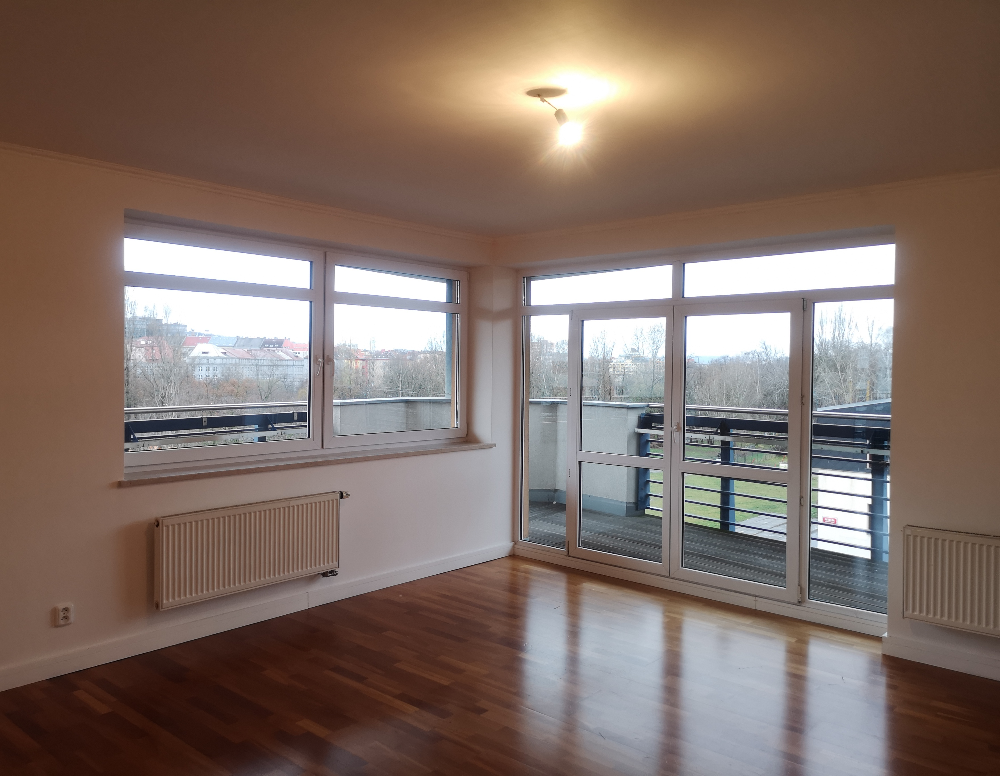{ width="45%"}
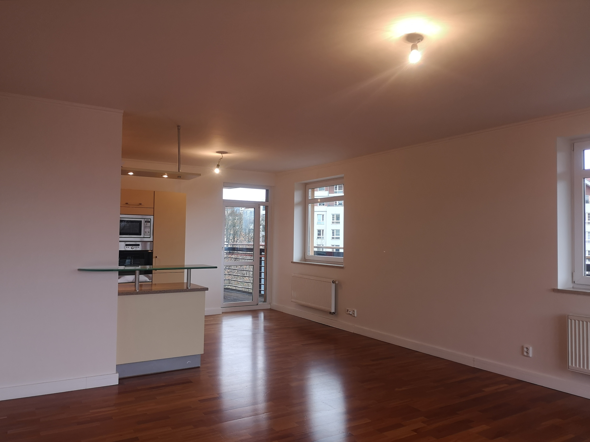{ width="45%"}
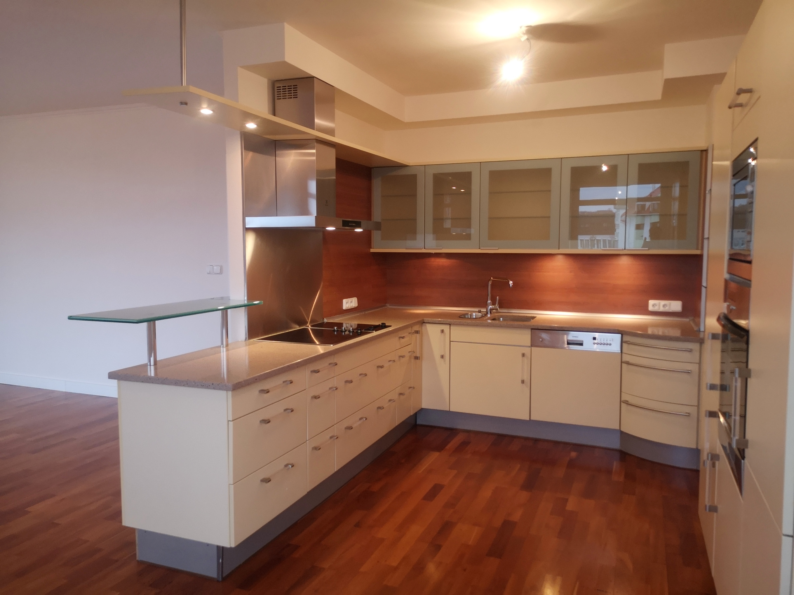{ width="45%"}
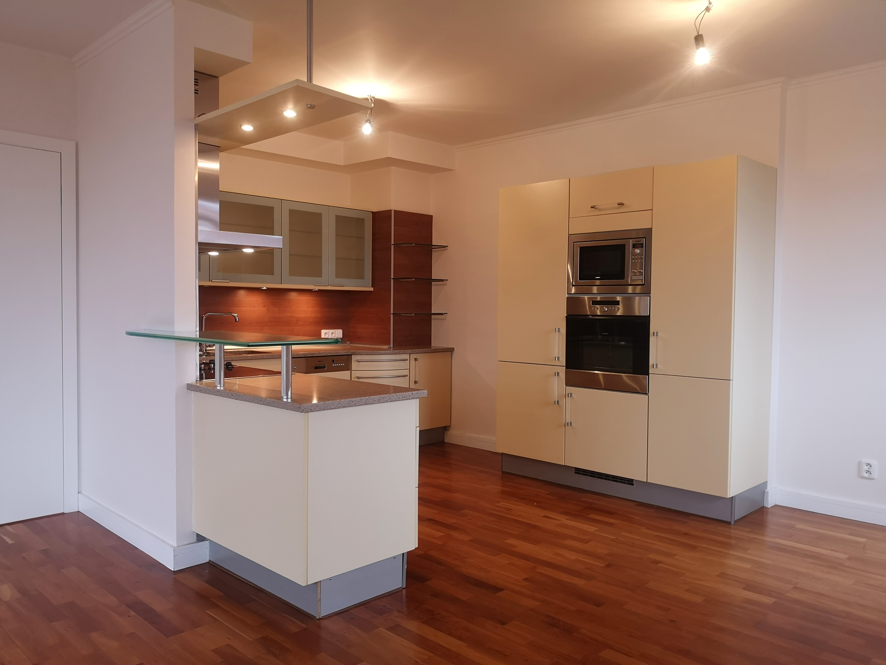{ width="45%"}

### Chodba
{ width="45%"}
{ width="45%"}
{ width="45%"}

### Koupelna velká
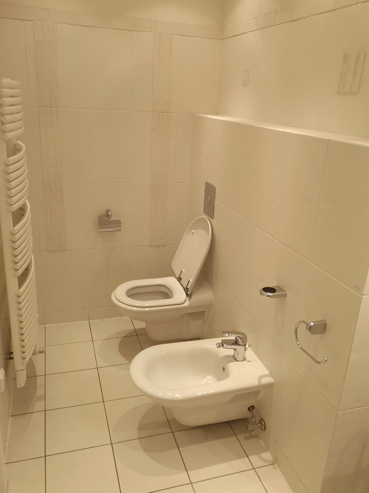{ width="45%"}
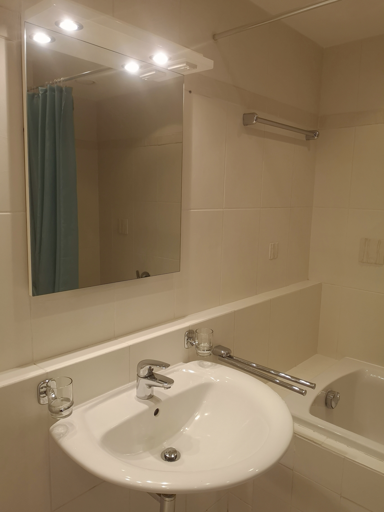{ width="45%"}
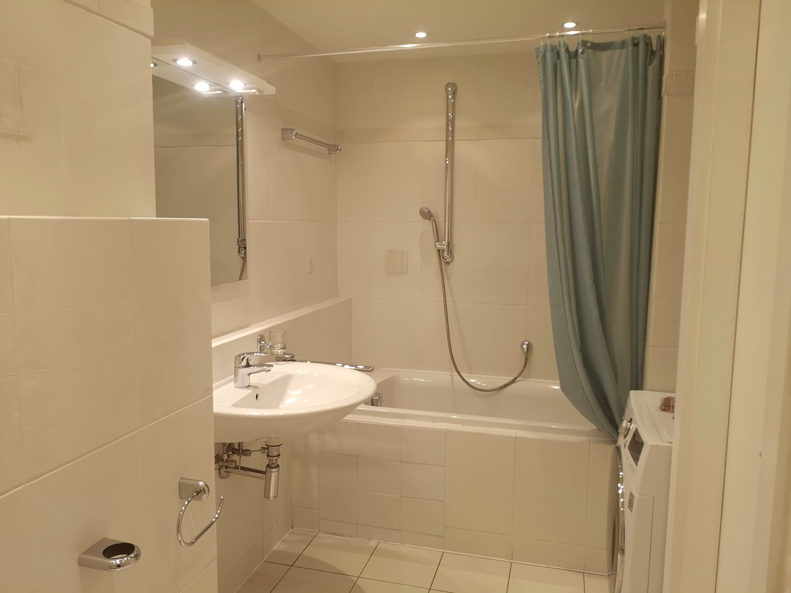{ width="45%"}

### Koupelna malá
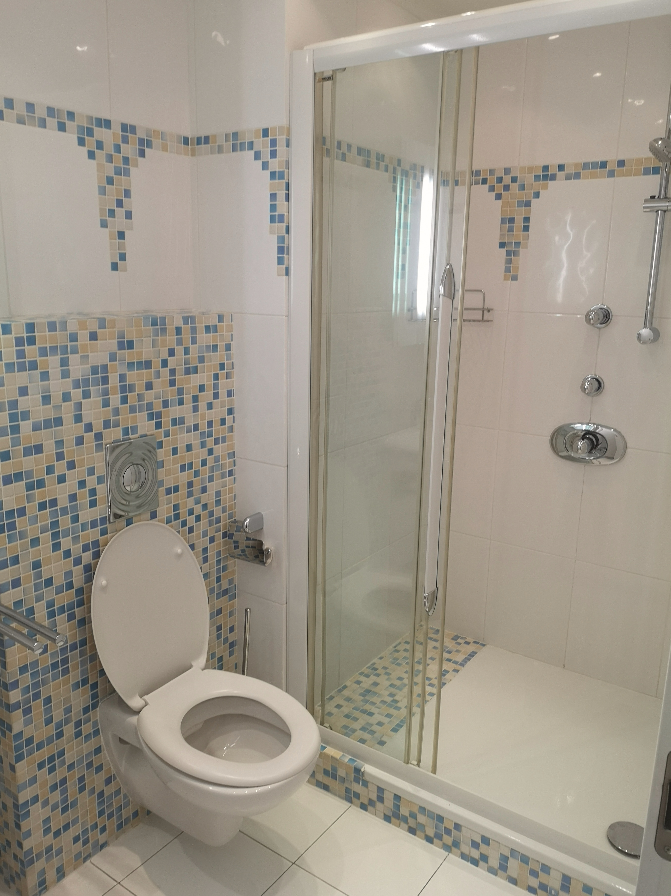{ width="45%"}
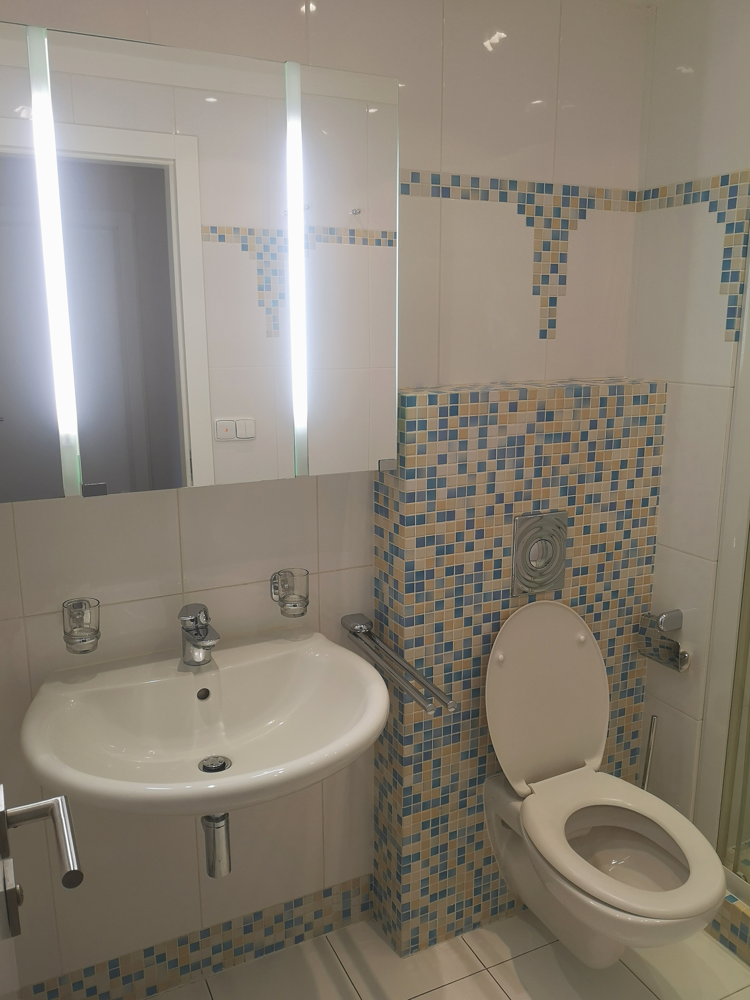{ width="45%"}

### Pracovna
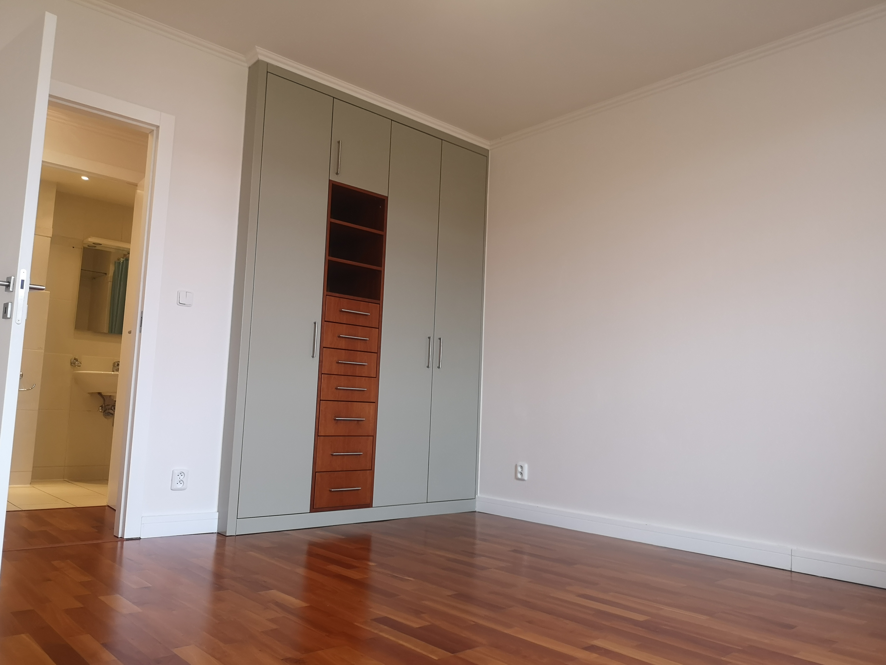{ width="45%"}

### Ložnice západ
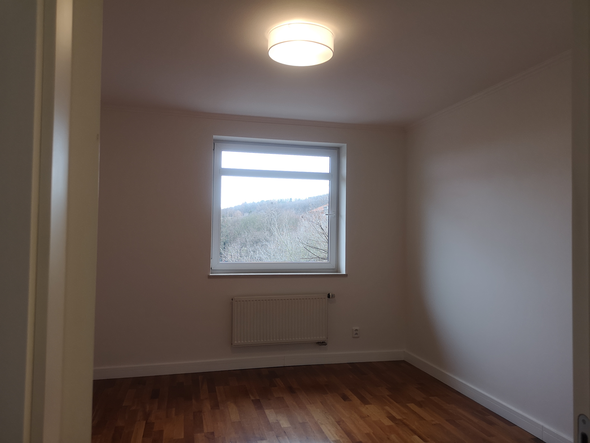{ width="45%"}

