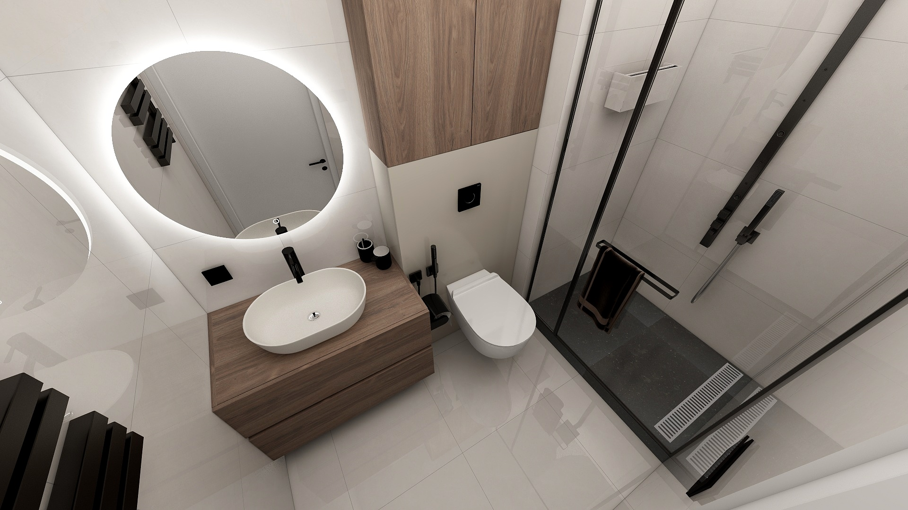

# Malá koupelna

## Vizuální inspirace

Následující obrazky slouží jako inspirace pro design koupelny.

{ width="45%" }
{ width="45%" }

## Specifikace

* Podlaha
    * 4.16 m2: plocha (se sprchovým koutem) - (2.60 x 1.60 m)
        * 2.72 m2: plocha (bez sprchového koutu) - (1.70 x 1.60 m)
        * 1.17 m2: plocha (sprchový kout) - (0.90 x 1.30 m)
    

* Stěny sprchový kout
    * 9.84 m2: plocha
        * 3.84 m2: boční stěna sprchový kout - (2.40 x 1.60 m)
        * 2.16 m2: přední stěna sprchový kout - (2.40 x 0.9 m)
        * 3.84 m2: plocha (sprchový kout) - (2.40 x 1.60 m)

* Stěny umyvadlo
    * 7.92 m2: plocha
        * 4.08 m2: přední stěna umyvadlo - (2.40 x 1.70 m)
        * 3.84 m2: boční stěna umyvadlo - (2.40 x 1.60 m)

## Produkty

* Dlažba + obklady (sprchový kout): [EBS Pisa dlažba](https://www.senesi.cz/ebs-pisa-dlazba-60x120-gold-matna)
* Radiátor [PMH Theia T2BL](https://www.senesi.cz/pmh-theia-t2bl-radiator-elektricky-154x50cm-topna-tyc-ht1-vpravo-cerna)