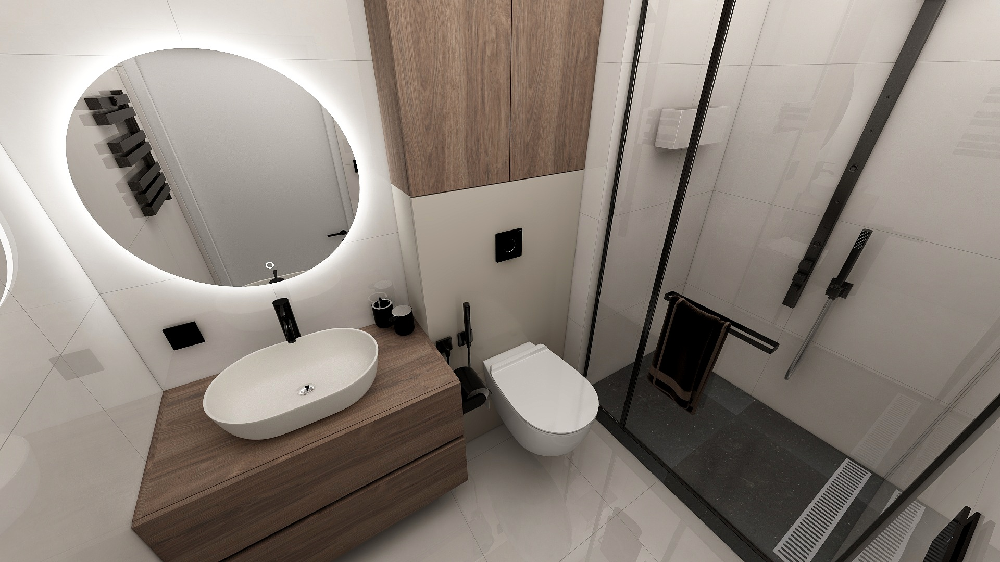
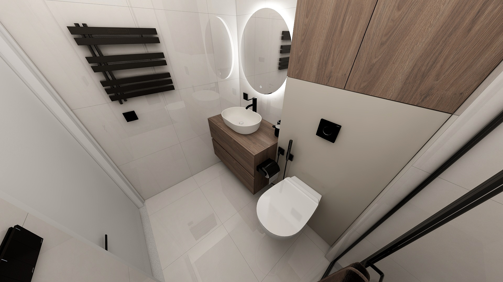

# Malá koupelna

## Vizuální inspirace

Následující obrazky slouží jako inspirace pro design koupelny.

{ width="45%" }
{ width="45%" }
{ width="45%" }
{ width="45%" }

## Stavební úpravy

* Bourání staré koupelny a likvidace odpadů
* Připrava elektřiny pro elektrický radiátor (na levé zdi od vchodu do koupelny).
* Změna pozice zásuvky vedle umyvadla.
* Připrava elektřiny pro LED světlo s pohybovým čidlem pod skříňkou s umyvadlem.
* Vyměna bodového osvětlění 
* Výměna ventilátoru pro odvětrávání vlhkosti (v případě nutnosti i nové podhledy).
* Příprava podkladu pro dlažbu a obklady (vyrovnání, hydroizolace, atd.).
* Instalace podomítkovou splachovací nádržku, bidetovou spršku a závěsného WC.
* Dlažba a obklady koupelny (formát 60x60 a 120x60).
* Instalace umyvadla a sifonu.
* Vestavba vaničky pro sprchový kout ze stejné dlažby.
* Instalace sprchového systému a dveří do sprchy.
* Nainstalovat nové vypínače a zásuvky.
* Instalace zrdadla a elektřického radiátoru.

## Specifikace

* Podlaha
    * 4.16 m2: plocha (se sprchovým koutem) - (2.60 x 1.60 m)
        * 2.72 m2: plocha (bez sprchového koutu) - (1.70 x 1.60 m)
        * 1.17 m2: plocha (sprchový kout) - (0.90 x 1.30 m)
    

* Stěny sprchový kout
    * 9.84 m2: plocha
        * 3.84 m2: boční stěna sprchový kout - (2.40 x 1.60 m)
        * 2.16 m2: přední stěna sprchový kout - (2.40 x 0.9 m)
        * 3.84 m2: plocha (sprchový kout) - (2.40 x 1.60 m)

* Stěny umyvadlo
    * 7.92 m2: plocha
        * 4.08 m2: přední stěna umyvadlo - (2.40 x 1.70 m)
        * 3.84 m2: boční stěna umyvadlo - (2.40 x 1.60 m)
