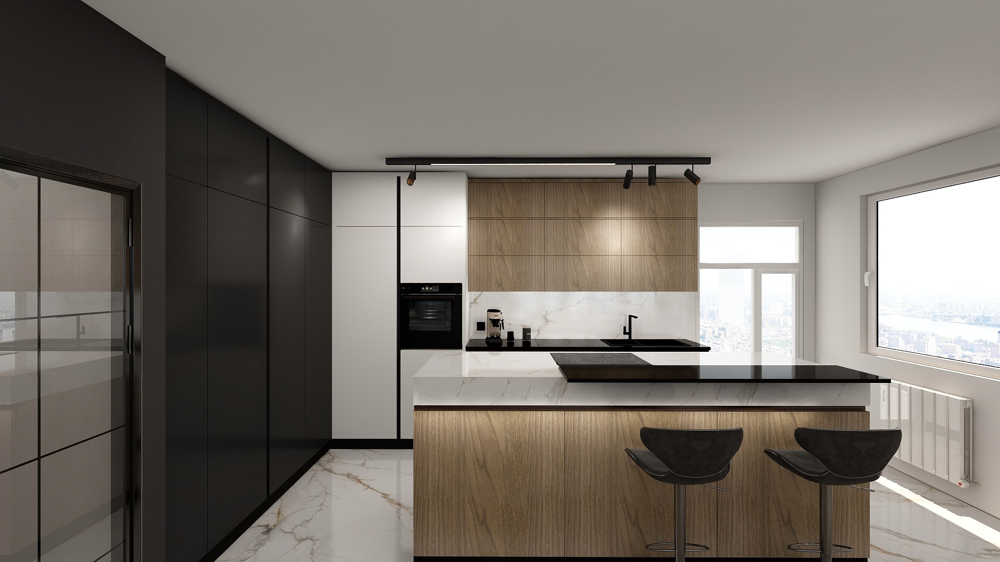
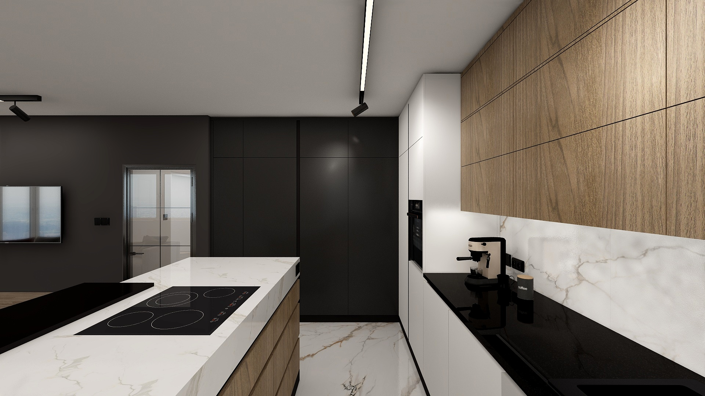
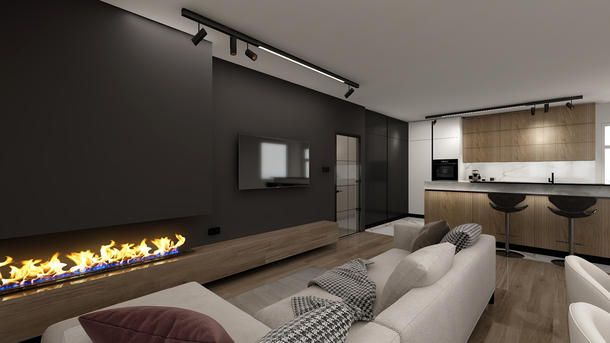
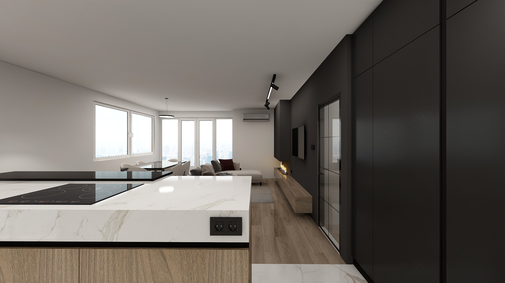
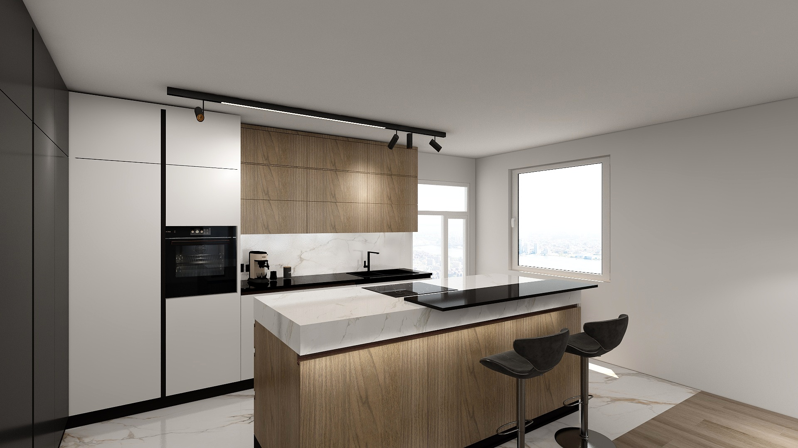

# Kuchyně

Kuchyňská linka je součástí obývacího pokoje.
Rozložení kuchyňské linky je zobrazeno na následujícím obrázku. Tvary označené modře vyžadují přívod vody a napojení na odpad, červené tvary vyžadují přívod elektřiny, žluté tvary značí uložný prostor.

## Stěna se spotřebiči

## Stěna s dřezem a myčkou nádobí
  

## Ostrůvek

## Vizuální inspirace

Následující obrazky slouží jako inspirace pro design kuchyně.

{ width="45%" }
{ width="45%" }
{ width="45%" }
{ width="45%" }
{ width="45%" }
{ width="45%" }

