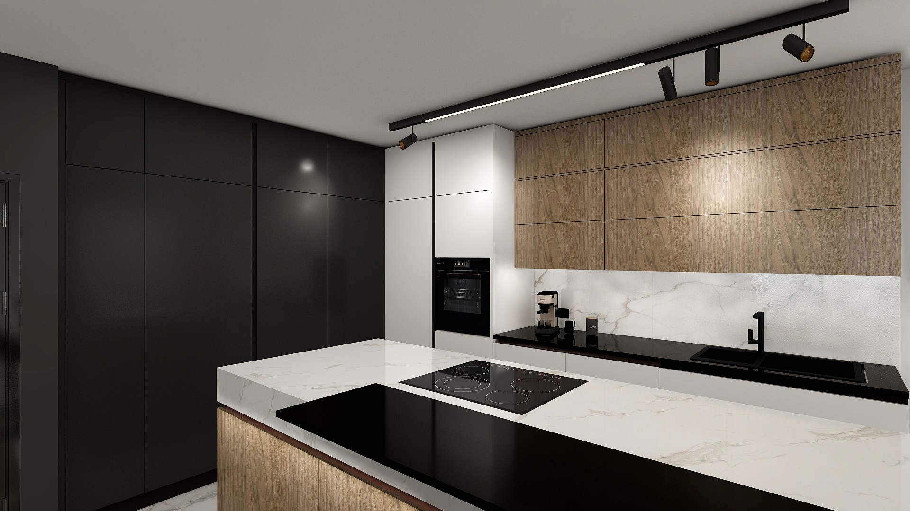

# Kuchyně

Kuchyňská linka je součástí obývacího pokoje. Skříňky kuchyňské linky jsou v **bílém matu** a několika **prvky dřevěného děkoru**. Pracovní deska kuchyňské linky je z **umělého kamene** či jiného odolného povrchu proti teplu ve vzoru s imitací mramoru. Kuchyská linka je složena ze 3 komponent:

* Stěna se spotřebiči (lednice, mrazák, trouba, mikrovlnná trouba) a skříní na suché potraviny (přibližně délka cca 2.48m, výška 2.57m, hloubka 0.65m).
* Stěna s dřezem, myčkou nádobí, odpadkovým košem a skříněmi na nádobí (přibližně délka cca 3.6m, výška 2.57m, hloubka 0.65m).
* Ostrůvek s indukční varnou deskou, skříněmi na nádobí, barovou deskou a vestavěnou chladničkou (přibližná délka cca 1.8m, výška 0.90m nebo 0.92m, hloubka 1.2m).

Rozložení kuchyňské linky je zobrazeno na následujícím obrázku. Tvary označené modře vyžadují přívod vody a napojení na odpad, červené tvary vyžadují přívod elektřiny, žluté tvary značí uložný prostor.

## Stěna se spotřebiči

Stěna se spotřebiči je složena z následujících prvků:

- Modul s lednicí
- Modul s mrazákem
- Modul s troubou a mikrovlnnou troubou
- Skříň na suché potraviny

## Stěna s dřezem a myčkou nádobí

Stěna s dřezem a myčkou nádobí je složena z následujících prvků:

- Spodní skříňka na nádobí (60 cm)
- Myčka na nádobí (60 cm)
- Dřez s odpadkovými koši (1x směsný odpad, 1x kovový odpad, 1x sklo) (90 cm nebo 92 cm)
- Skříňka s odpadkovým koši (1x plastový odpad, 1x papír) (60 cm)
- Spodní skříňka na nádobí (60 cm)
- Skříňka na nádobí (30 cm)

## Ostrůvek

Ostrůvek je složen z následujících prvků:

- Indukční varná deska
- Velká skříňka na nádobí (100 cm) 
- 2x Malá skříňka na nádobí (40 cm)
- 2x Střední skříňka (60 cm)
- Prostor na mini chladničku na víno/pivo (výška 75 cm x šířka 60 cm)
- Dřevěná barová deska

## Vybavení / spotřebiče

Kuchyňská linka je vybavena následujícími vestavěnými spotřebičy:

- [Indukční varná deska](https://www.alza.cz/siemens-ex875hvc1e-d7992065.htm)
- Trouba
- Mikrovlnná trouba
- Myčka nádobí
- Lednice
- Mrazák
- Malá chladnička v ostrůvku na víno/pivo

## Vizuální inspirace

Následující obrazky slouží jako inspirace pro design kuchyně.

{ width="45%" }
{ width="45%" }
{ width="45%" }
{ width="45%" }

