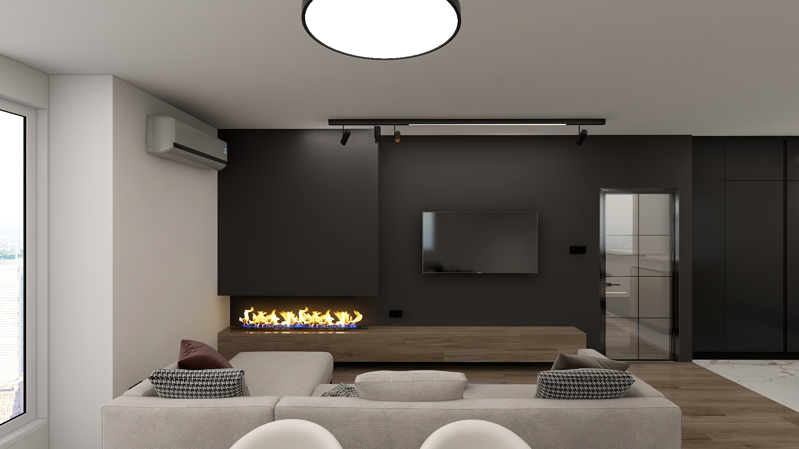
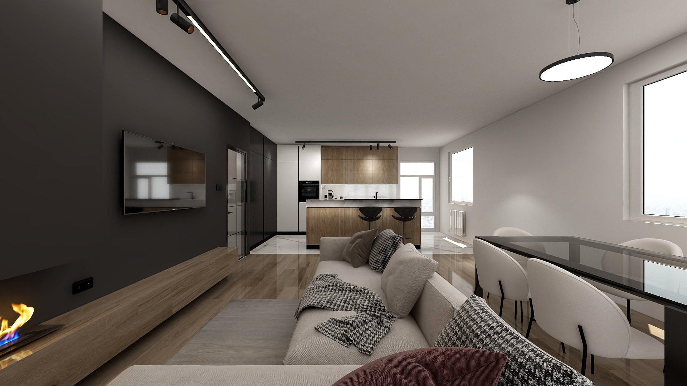

# Obývací pokoj

Obývací pokoj je propojený s kuchyňským koutem a jídelním stolem. V obývacím pokoji se nachází pohovka, televize a parní krb.

## Vizuální inspirace

Následující obrazky slouží jako inspirace pro design obývací pokoj.

{ width="45%" }
{ width="45%" }
{ width="45%" }
{ width="45%" }